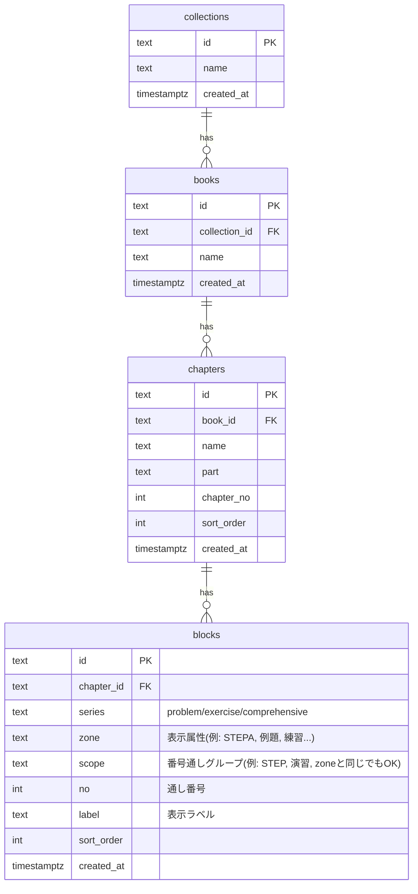

# 問題集管理（多教材対応）ER図（最小構成）

この段階では既存テーブルを活かし、追加列/テーブルだけで多教材の番号体系に対応します。

- collections：問題集シリーズ（4STEP / FocusGold / サクシード…）
- books：冊子（数学ⅠA / 数学ⅡB …）※ collections に所属
- chapters：章（第1章 数と式…）
- blocks：小問（問題番号）。表示属性 zone と、番号の通しグループ scope を分離

## Mermaid ER

## 運用例

### 4STEP（STEP系と演習系で通し番号が別）
- STEPA / STEPB / 応用 → zone はそれぞれ、scope は共通で `STEP`
- 演習A / 演習B → zone はそれぞれ、scope は共通で `演習`

### FocusGold（例題/練習/StepUp/章末がそれぞれ通し）
- zone = scope = `例題` / `練習` / `StepUp` / `章末`（=それぞれ別通し）

### 「1 と A が別通し」など
- zone = `1` / `A` のようにしても良いが、より分かりやすくするなら
  - zone = `第1問` のような表示属性
  - scope = `数列` などの通し単位
といった運用も可能
